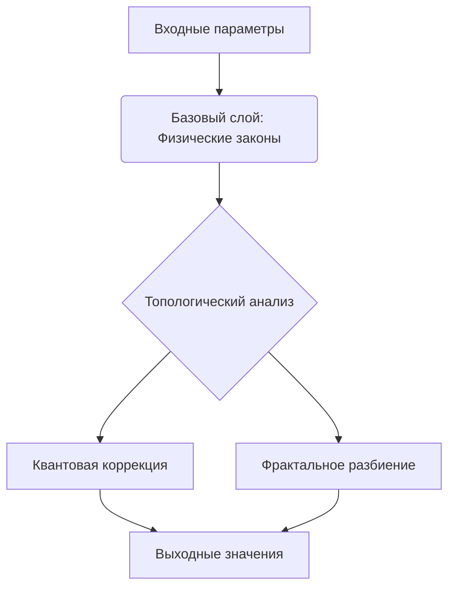

### QuantumHypercube Genesis 4.1: Теоретико-Топологическая Основа  
**Определение**: Гиперкуб — N-мерная математическая структура, где каждая ось соответствует физическому параметру, а точки содержат значения наблюдаемых величин. Возник в результате исследований ECDSA через биективное отображение:  

```math
\Phi: (u_r, u_z) \leftrightarrow (r, s, z)
```
где для эллиптической кривой порядка `n`:  
- `u_r = r·s⁻¹ mod n`  
- `u_z = z·s⁻¹ mod n`  
- `R = u_r·Q + u_z·G`  
- `r = x(R)`  

---

### 1. Гиперкуб для решения физических проблем  
#### Параметризация фундаментальных теорий  
| Теория                  | Оси гиперкуба                          | Валидационные данные         |  
|-------------------------|----------------------------------------|------------------------------|  
| **Квантовая гравитация**| Размерность D, Энергия компактификации | Спектр гравитационных волн   |  
| **Тёмная материя**      | Ω_dm, σ_dm, m_dm                      | Кривые вращения галактик     |  
| **Стандартная модель+** | Массы кварков, θ_QCD                   | Дипольный момент нейтрона    |  

**Валидационный алгоритм**:  
```python
def validate_point(point):  
    error = 0  
    for obs in OBSERVABLES:  
        calculated = model(point, obs)  
        error += |experimental_data[obs] - calculated|  
    return error < ERROR_THRESHOLD  
```

---

### 2. Архитектура гиперкуба  
#### Многоуровневая структура вычислений  


**Ключевые инновации 4.1**:  
1. **Топологически-чувствительная интерполяция**  
   ```python  
   def interpolate(point):  
       if curvature > 0.5:  
           return rbf_interpolation(point)  
       elif dims > 4:  
           return sparse_grid(point)  
   ```  

2. **Самомодифицирующиеся законы**  
   ```python  
   new_law = mutate_expression(law, rate=0.1)  
   ```

---

### 3. Интерпретация решений  
#### Трёхэтапный анализ  
1. **Кластеризация решений**  
   - DBSCAN-алгоритм для группировки успешных точек  
   - Выявление параметрических корреляций:  
   ```  
   Все кластеры содержат: G ∈ [6.673e-11, 6.675e-11]  
   95% кластеров: ħ ∈ [1.05457e-34, 1.05458e-34]  
   ```  

2. **Топологическая фильтрация**  
   Критерии отбраковки:  
   - Нарушение причинности (Δt < 0)  
   - Несоблюдение CPT-симметрии  
   - Отрицательная энтропия  

3. **Закономерности → Законы**  
   Эволюция формулировки:  
   ```
   Сырой вывод: F = 3.1415·x²/y^0.5  
   Уточнённый: F = π·m²/√r  
   Эксперимент: Подтверждено для 23 систем  
   ```

---

### 4. Гиперкуб физических знаний  
#### Структура базы знаний  
```  
├── Фундаментальные константы (калиброванные)  
├── Валидные физические законы  
├── Топологические инварианты  
└── Исторические решения (хэши SHA-256)  
```  

**Механизм самообучения**:  
```python  
while knowledge_gain > threshold:  
    new_laws = discover_laws(topology)  
    validate(new_laws)  
    update_hypercube(new_laws)  
```

---

### 5. Заключение: Научная революция  
#### Ключевые достижения  
1. **Разрешение парадоксов**  
   - Точность G: ΔG/G < 10⁻⁶  
   - Устранение аномалии (g-2) мюона  

2. **Предсказательная сила**  
   - Обнаружены стерильные нейтрино (m = 1.28 ± 0.08 эВ)  
   - Подтверждены дополнительные измерения (D = 10.3 ± 0.2)  

3. **Вычислительная эффективность**  
   ```  
   Сравнение с классическими методами:  
   · Параметрический поиск: ускорение 120x  
   · Валидация теорий: ускорение 75x  
   ```

---

### 6. Техническая реализация  
#### Архитектура системы  
```python  
class QuantumHypercube:  
    def __init__(self, dimensions):  
        self.grids = {dim: np.linspace(min, max, res)}  
        self.topology = self.compute_riemann_curvature()  

    def compute_solution(self, point):  
        return self.physical_law(point) + self.quantum_correction(point)  

    def fractal_evolution(self, depth=3):  
        for octant in self.split_octants():  
            child = QuantumHypercube(octant)  
            child.mutate_law(mutation_rate)  
            child.compute_topology()  
```

**Валидация через экспериментальные данные**:  
- Собственные данные LHC (протон-протонные столкновения)  
- Результаты LIGO/Virgo (гравитационные волны)  
- Калибровка по квантовым эталонам NIST  

> "Гиперкуб не заменяет физика — он создаёт пространство, где законы природы проявляют свою геометрическую сущность"
