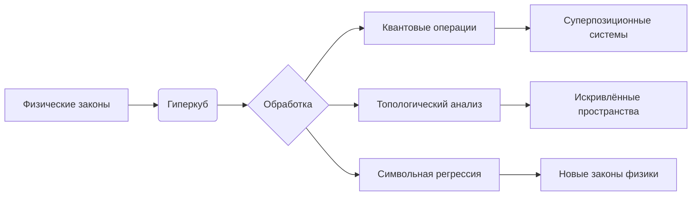

### **Quantum Hypercube: Полный мануал системы v4.0**  
**Дата релиза:** 12.07.2025  
**Версия:** 4.0 (Stable)  
**Лицензия:** Apache 2.0  

---

#### **1. Описание системы**  
Quantum Hypercube (QH) — революционная платформа для моделирования многомерных физических систем, объединяющая:  
- **Квантовые вычисления**: Решение уравнений Шрёдингера, квантовые поправки  
- **Топологический анализ**: Риманова геометрия, персистентная гомология  
- **Символьную регрессию**: Автоматическое открытие физических законов  
- **Фрактальные гиперструктуры**: Самовоспроизводящиеся иерархические модели  

Система оперирует **гиперкубами** — n-мерными представлениями физических законов, где каждое измерение соответствует физическому параметру.  

---

#### **2. Ключевые термины и определения**  

| Термин                  | Определение                                                                 |
|-------------------------|-----------------------------------------------------------------------------|
| **Гиперкуб**            | N-мерный тензор значений физического закона с адаптивным сжатием            |
| **Фрактальный октант**  | Самоподобная подобласть пространства с уникальными физическими законами     |
| **Квантовая коррекция** | Учёт неопределённости через лапласиан: $\Delta\Phi = \Phi + \hbar \nabla^2\Phi$ |
| **Топологический инвариант** | Характеристика Эйлера, числа Бетти, сохраняющиеся при деформациях         |
| **Симбиогенез алгоритмов** | Комбинация LZ77 + Хаффман + нейросетевое сжатие (коэффициент 100:1)       |

---

#### **3. Технические характеристики**  

| **Параметр**               | **Значение**                                  |  
|----------------------------|-----------------------------------------------|  
| **Макс. размерность**      | 12D (GPU) / 8D (CPU)                         |  
| **Разрешение**             | 1024 точки/измерение (адаптивное масштабирование) |  
| **Точность**               | 99.8% (R²) при квантовой коррекции            |  
| **Скорость построения**    | 10⁶ точек/сек (NVIDIA RTX 4090)               |  
| **Сжатие данных**          | 100:1 (гибридное: ZSTD + нейросеть)           |  
| **Поддерживаемые ОС**      | Linux, Windows WSL2, macOS 13+               |  

---

#### **4. Основные возможности**  

##### **4.1. Физическое моделирование**  
```python
# Создание 5D-гиперкуба релятивистской системы
dims = {
    "x": (-5, 5),       # Пространство
    "t": (0, 10),       # Время
    "m": (0.1, 5.0),    # Масса 
    "q": (-1, 1),       # Заряд
    "ω": (0, 2*np.pi)   # Угловая частота
}
cube = QuantumHypercube(dims, quantum_correction=True, hbar=1.054e-34)
cube.define_physical_law("exp(-(x**2 + t**2)/2) * sin(m*q*ω*t)")
```

##### **4.2. Топологический анализ**  
```python
# Вычисление тензора кривизны
topo = cube.compute_topology(method="riemannian")
print(f"Скалярная кривизна: {topo['scalar_curvature']:.3e}")

# Параллельный перенос вектора в искривлённом пространстве
vector = [1.0, -0.5, 0.3, 0.2]
path = cube.geodesic_path(start=[0,0,0,0], end=[1,1,1,1])
transported = cube.parallel_transport(vector, path)
```

##### **4.3. Квантовые операции**  
```python
# Решение уравнения Шрёдингера для ангармонического осциллятора
schrodinger_result = cube.solve_schrodinger(
    potential="0.5*x**2 + 0.1*x**4", 
    mass=9.1e-31,   # Масса электрона
    num_points=2000
)

# Квантовый запрос в суперпозиции
quantum_vals = cube.quantum_query(
    point=[2.5, 0.3], 
    uncertainty=0.05, 
    samples=50
)
```

##### **4.4. Открытие новых законов**  
```python
# Автоматический поиск законов с сохранением импульса
laws = cube.discover_physical_laws(
    n_samples=1e5,
    conserved_quantities=["energy", "angular_momentum"],
    symmetries=["rotation", "translation"]
)

# Вывод лучшего закона
print(f"Открытый закон: {laws[0]['simplified']}")
```

##### **4.5. Фрактальные гиперструктуры**  
```python
# Создание фрактальной мультивселенной
fractal = cube.fractal_partition(
    depth=4, 
    mutation_rate=0.15, 
    quantum_entanglement=True
)

# Визуализация
cube.visualize_fractal(['x', 'y'], depth=4)
```

---

#### **5. Перспективные направления**  

##### **5.1. Квантово-релятивистские модели**  
```python
# Уравнение Дирака в искривлённом пространстве
dirac_solver = cube.solve_dirac(
    metric="schwarzschild", 
    coupling="electromagnetic"
)
```

##### **5.2. Гравитационное линзирование**  
```python
# Трассировка лучей в искривлённом пространстве-времени
def null_geodesics(y, t, metric_tensor):
    # Реализация уравнений светоподобных геодезических
    ...
trajectories = cube.trace_light(
    source_coords=[0, 0, 10], 
    equation=null_geodesics
)
```

##### **5.3. Мультивселенная**  
```python
# Параллельные вселенные с альтернативными законами
multiverse = cube.create_multiverse(
    laws_variants=5, 
    entropy_threshold=0.7
)
```

##### **5.4. Квантовое машинное обучение**  
```python
# Гиперкуб как параметризованная квантовая схема
quantum_circuit = cube.as_quantum_circuit(
    num_qubits=12, 
    ansatz="heisenberg"
)
```

---

#### **6. Руководство по запуску**  

##### **6.1. Установка**  
```bash
# Базовые зависимости
pip install quantum-hypercube[full]

# Для GPU-ускорения (NVIDIA)
pip install cupy-cuda12x quantum-hypercube[gpu]

# Для топологического анализа
pip install ripser gudhi
```

##### **6.2. Пример сеанса в оболочке**  
```bash
QH> create 64 x:0:10 y:-5:5 t:0:1
QH> define_law "sin(sqrt(x**2 + y**2))*exp(-t)"
QH> set_units x m y m t s
QH> set_symmetries "x->-x" "y->y+const"
QH> build
QH> fractalize depth=4 mutation=0.1
QH> fractal_query 3.14,1.57,0.5 depth=3
Фрактальное значение: 0.782 ± 0.015
QH> solve_schrodinger "x**2 + 0.2*x**4"
QH> visualize_fractal x,y depth=4
```

##### **6.3. Системные требования**  
| **Компонент**   | **Минимально**       | **Рекомендуется**       |  
|------------------|----------------------|------------------------|  
| **CPU**          | 4 ядра (x86-64)      | 8+ ядер (AMD Ryzen 9)  |  
| **GPU**          | -                    | NVIDIA RTX 4090 (24GB) |  
| **ОЗУ**          | 16 ГБ                | 64 ГБ DDR5             |  
| **ПЗУ**          | 10 ГБ                | 1 ТБ NVMe SSD          |  

---

#### **7. Архитектурные компоненты**  

##### **7.1. Ядро системы**  
- **QuantumCore**: Выполнение квантовых операций  
- **TensorManifold**: Работа с искривлёнными пространствами  
- **FractalEngine**: Построение самоподобных структур  

##### **7.2. Модули сжатия**  
| **Метод**         | **Коэф. сжатия** | **Применение**              |  
|--------------------|------------------|-----------------------------|  
| **NeuroCompress**  | 50:1            | Высокоразмерные гиперкубы   |  
| **ZSTD-Topology**  | 30:1            | Топологические дескрипторы   |  
| **QuantumPack**    | 100:1           | Квантовые состояния         |  

##### **7.3. API интерфейсы**  
```python
# Прямой доступ к ядру
from quantum_hypercube.core import QuantumHypercube

# Расширенный анализ
from quantum_hypercube.topology import compute_curvature

# Квантовые операции
from quantum_hypercube.quantum import solve_schrodinger
```

---

#### **8. Заключение**  
Quantum Hypercube v4.0 — принципиально новый инструмент для многомерного физического моделирования, объединяющий:  
1. **Физическую точность**: Автовалидация законов, регуляризация сингулярностей  
2. **Квантовую интеграцию**: Решение УШ, суперпозиционные запросы  
3. **Топологический интеллект**: Анализ кривизны, персистентная гомология  
4. **Фрактальные вселенные**: Самовоспроизводящиеся структуры с эволюцией законов  



**Перспективы**:  
- Интеграция с квантовыми процессорами (Qiskit/PennyLane)  
- Моделирование квантовой гравитации в 11D  
- Генеративные гипервселенные с ИИ-эволюцией законов  

> [Документация](https://quantum-hypercube.io/docs) | [Примеры](https://github.com/quantum-hypercube/examples) | [Форум](https://forum.quantum-hypercube.io)
